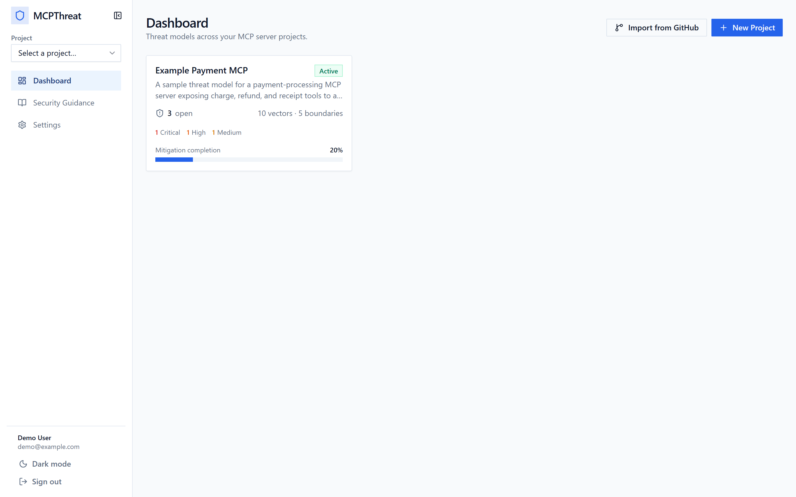
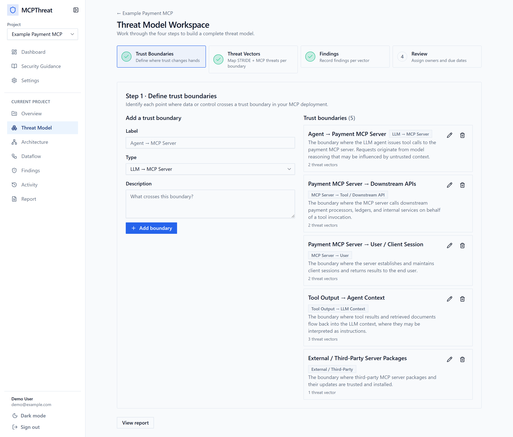
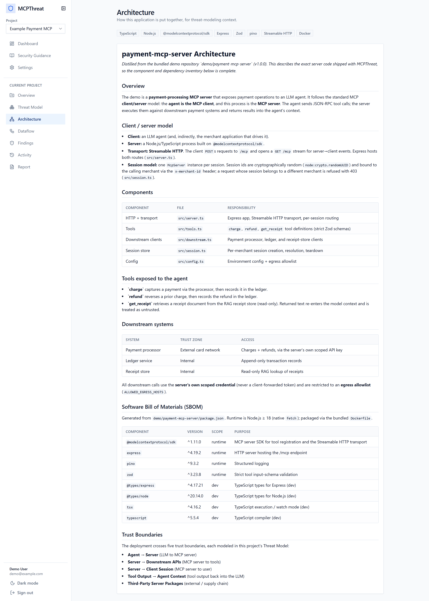
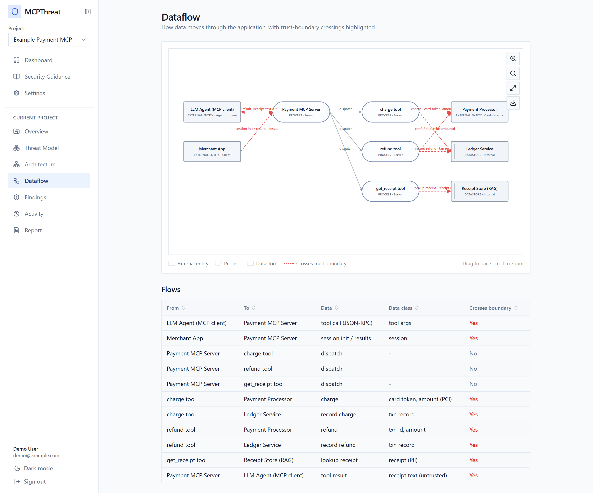
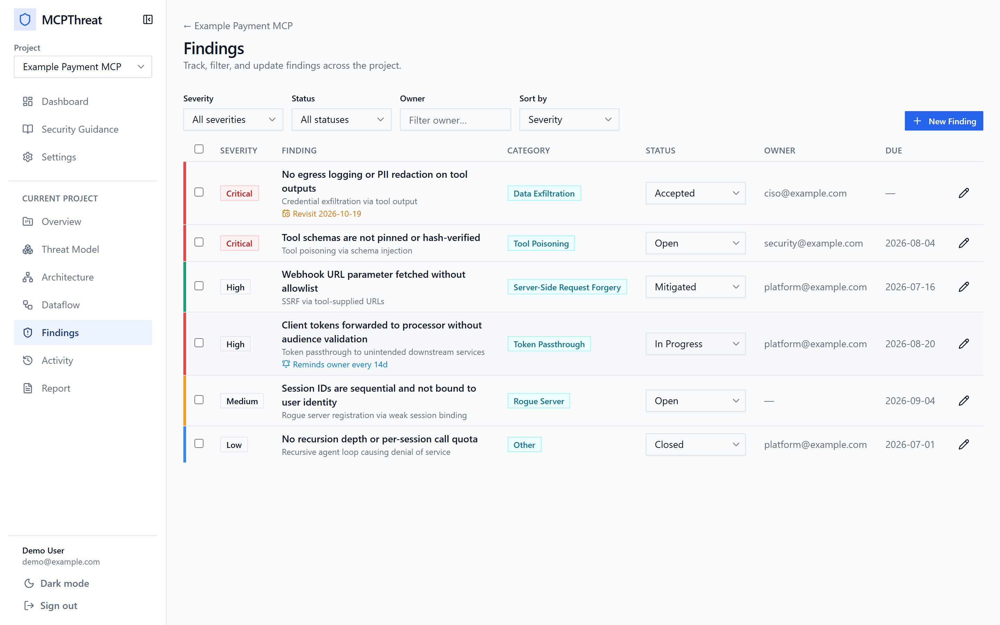
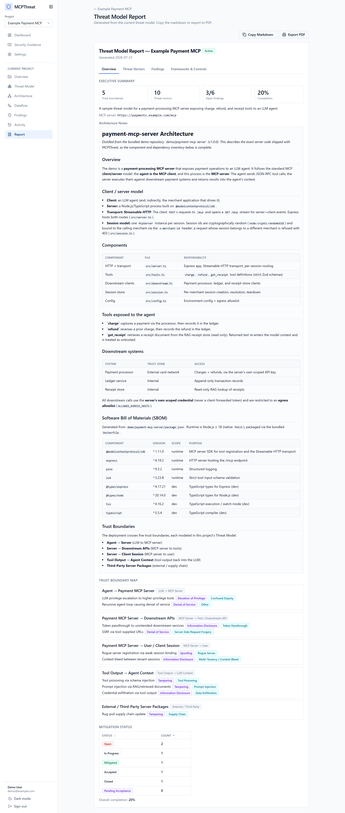

# MCPThreat

**MCPThreat is a highly functional prototype for rapid threat modeling of Model Context Protocol (MCP) servers**

MCP connects LLM agents to real tools, data, and downstream systems, and in doing so introduces a class of risks that traditional threat modeling doesn't cover well such as prompt injection, tool poisoning, token passthrough, context bleed between tenants, and more. MCPThreat turns reasoning about those risks into a structured, repeatable workflow. You map the trust boundaries, chart the dataflows, catalog the threats against a purpose-built taxonomy, and track every finding to mitigation, then hand a report to a stakeholder at the end.

It can also **point at a GitHub repository and bootstrap the whole model for you**, distilling the architecture, drawing the dataflow, and intelligently prepopulating threats for review.

---

## Screenshots

**Dashboard**: every project at a glance, with open-finding counts, severity breakdown, and mitigation progress.



**Threat model**: trust boundaries, an interactive trust-boundary map, and a likelihood × impact risk matrix.



**Architecture**: a client/server breakdown and a Software Bill of Materials (SBOM), in this case generated from the bundled demo MCP server.



**Dataflow**: an interactive data-flow diagram with clearly defined trust boundaries.



**Findings**: a filterable, sortable register with severity, status, owners, evidence, and the risk-acceptance workflow.



**Report**: a tabbed, print/PDF-ready report pulling the whole model together.



---

## Features

**Threat modeling**
- Trust boundaries and STRIDE + MCP-specific threat vectors, driven by a single-source taxonomy (`src/lib/taxonomy.ts`).
- Interactive **trust-boundary map** and a likelihood × impact **risk matrix** with residual-risk scoring.
- **Architecture** and **Dataflow** sections as first-class data, with an interactive, exportable DFD.

**Findings & governance**
- Findings register with severity, a status lifecycle, owners, due dates, evidence, and file attachments.
- **Risk-acceptance workflow**: off / single-approver / dual sign-off (assessor + client), severity-gated, with four-eyes enforcement and lapse-and-reopen review timers.
- Append-only **audit trail** and recurring owner reminders.
- **Reports** with per-section tabs and a print/PDF-friendly layout.

**GitHub-driven auto threat modeling**
- Point MCPThreat at a public GitHub repo; it fetches (host-locked to `github.com`), prefilters the most relevant files, and uses Claude to distill architecture, dataflows, and threats.
- **Conservative by design**: only well-evidenced items are created, each tagged *AI-suggested* with a confidence level and cited evidence, behind a review banner.

**Collaboration & security posture**
- Projects with owner / admin / member / viewer roles; every access path gated by one authorization check.
- **Security Guidance** knowledge base mapping each MCP threat category to concrete mitigations and cited references.
- The product practices what it models. See [Security posture](#security-posture).

---

## Quick start

```bash
npm install
cp .env.example .env          # then set NEXTAUTH_SECRET (openssl rand -base64 32)
npx prisma migrate dev        # create the SQLite dev database
npm run seed                  # seed the demo project + logins
npm run dev                   # http://localhost:3000
```

**Demo logins** (from the seed): `demo@example.com` (assessor) and `client@example.com` (client), both with password `password123`.

### Enabling GitHub import (optional)

The "Import from GitHub" feature calls Claude, so it needs an API key. Set it in `.env`:

```bash
ANTHROPIC_API_KEY="sk-ant-..."   # enables automated analysis
ANALYSIS_MODEL=""                # optional model override (default: claude-opus-4-8)
GITHUB_TOKEN=""                  # optional; higher rate limits / private repos
```

Without a key the app runs normally and manual modeling is unaffected; the import feature simply reports that it isn't configured.

### GitHub OAuth login (optional)

Set `GITHUB_ID` and `GITHUB_SECRET` to show a "Continue with GitHub" button; otherwise the app runs on email/password alone. Callback URL: `http://localhost:3000/api/auth/callback/github`.

### Production database

Switch the `datasource` provider in `prisma/schema.prisma` to `postgresql` and point `DATABASE_URL` at Postgres. Enum-like fields are stored as `String` columns validated at the app layer, so no schema rewrite is needed.

### Bundled demo MCP server

[`demo/payment-mcp-server`](demo/payment-mcp-server) is a small, self-contained payment MCP server (Streamable HTTP transport; `charge` / `refund` / `get_receipt` tools; processor, ledger, and receipt-store clients). The seeded **Example Payment MCP** project's Architecture and Dataflow are derived from it, and its SBOM is generated from the demo's `package.json`.

---

## Commands

| Script | Purpose |
| --- | --- |
| `npm run dev` | Start the dev server |
| `npm run build` | Production build (typecheck + eslint) |
| `npm run lint` | ESLint |
| `npm test` | Vitest unit tests for the security-critical logic |
| `npm run seed` | Seed the demo project |
| `npm run db:reset` | DESTRUCTIVE: reset + re-seed the dev database |

`GET /api/health` returns `{ status, db }` for deployment checks.

## Testing

Unit tests (Vitest, in `tests/`) cover the pure, security-critical logic: risk scoring, the acceptance state machine, the SSRF and `github.com` host-lock guards, dataflow parsing, and metrics. Run `npm test`. Regenerate the screenshots above with `node docs/capture-screenshots.mjs` (dev server running + demo seeded).


## Tech stack

Next.js 14 (App Router) · TypeScript · Prisma (SQLite in dev, Postgres-portable) · NextAuth v4 · Tailwind CSS + hand-rolled shadcn-style primitives · React Hook Form + Zod · Vitest · `@anthropic-ai/sdk`.

## License
[Apache License, Version 2.0](https://www.apache.org/licenses/LICENSE-2.0.txt)